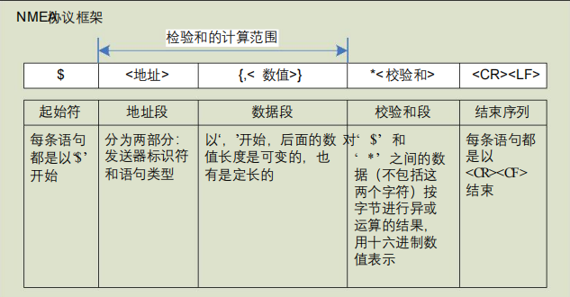
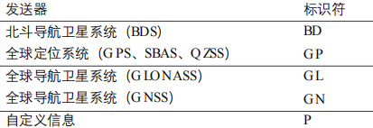
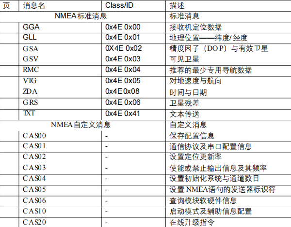
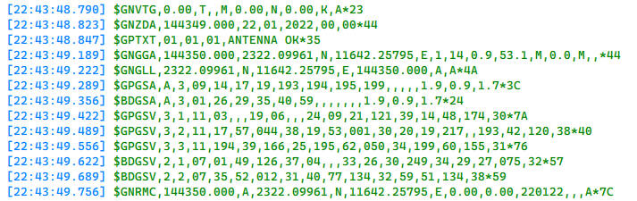

# GPS（全球定位系统）

## NEMA-0183协议：GPS接收机遵循的传输协议

### 地址
1. 发送器标识
   
   

2. 消息类型
   
   

### 数据段

以常见GN数据段举例
1. $GNVTG
   
2. $GNZDA
   
3. $GNGGA,144350.000,2332.09961,N,11642.25795,E,1,14,0.9,53.1,M,,*44
   
   字段0 <$GNGGA>：表明该消息为接收机定位信息

   字段1 <144350.000>：UTC时间hh:mm:ss——14:43:50.000

   字段2+字段3 <2332.09961,N>：纬度ddmm.mmmm——北纬23度32.09961分

   字段4+字段5 <11642.25795,E>：经度dddmm.mmm——东经116度42.25795分

   字段6 <1>：定位质量

   字段7 <14>：定位卫星数14颗（取值范围：00~24）

   字段8 <0.9>：水平精度因子

   字段9+字段10 <53.1,M>：海拔高度53.1米

   字段11：差分定位时间
   
   字段12：差分定位的参考站ID

   字段13 <44>：校验和（$到*之间数据的异或16进制结果）

4. $GNGLL
   
5. $GNRMC
