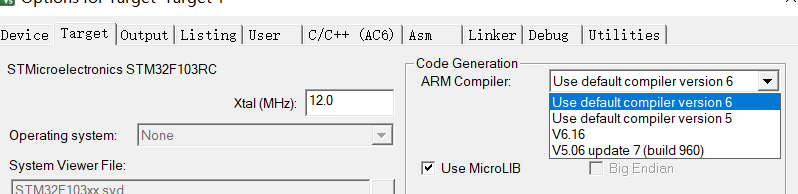

# STM32

## CMSIS标准

为了解决不同厂商生产的Cortex微控制器软件的兼容性问题，ARM与芯片厂商建立了CMSIS标准(Cortex MicroController Software Standard)，其架构如图[<sup>1</sup>](#refer1)。


*CMSIS架构*

## STM32开发方式


## 工程文件创建

### 寄存器版本

#### 工程结构解读

1. startup_stm32f10x_hd.s

* 初始化
* 设置堆、栈大小
* 配置SRAM作为数据储存器
* 调用SystemInit()
* 设置C库的分支入口"__main"

#### 创建过程
参见《STM32库开发实战指南》第6章

#### 遇到的bug

1. test.axf: Error: L6218E: Undefined symbol SystemInit (referred from startup_stm32f10x_hd.o).`

方法一：在main.c文件中添加SystemInit空函数
```
void SystemInit(void){
}
```

方法二：在startup_stm32f10x_hd.s文件中搜索一下SystemInit，找到一下代码，并将其中三句省略
```
Reset_Handler PROC
EXPORT Reset_Handler [WEAK]
IMPORT __main
;IMPORT SystemInit
;LDR R0, =SystemInit
;BLX R0
LDR R0, =__main
BX R0
ENDP
```
前提是比较简单的小工程不需要用到SystemInit,如果要用到SystemInit的话还是要在合适的位置加上SystemInit的函数定义。

2. Error: L6218E: Undefined symbol main (referred from entry9a.o)

第一种情况：如果main函数书写时出错，把main写mian；

第二种情况：如果在建立工程时未把main.c或是写main函数的文件添加到工程文件；

第三种情况：未编写main函数时也会出现。

### 标准库版本（固件库版本）

#### 工程文件结构

| 名称 | 用途 |
| - | :- |
| startup_stm32f10x_hd.s |  |

#### 创建过程

1. 新建本地工程文件，添加工程文件如下
```
Template_ Standard
└───Doc
│   │   file011.txt
└───Lib
│   └───CMSIS
│       │   file111.txt
│       │   file112.txt
│       │   ...
│   └───STM32F10x_StdPeriph_Driver
│       │   file111.txt
│       │   file112.txt
│       │   ...
└───User
    │   file021.txt
    │   file022.txt
    │   ...
└───
```
2. 进入keil添加工程文件


#### 遇到的bug

1. ../Lib/CMSIS/CM3/DeviceSupport/ST/STM32F10x\stm32f10x.h(317): error: redefinition of enumerator 'I2C2_ER_IRQn'

在C/C++选项卡里，把STM3210X_HD从prepocessor symbol define 里面删掉[<sup>2</sup>](#refer2)

1. ../Lib/CMSIS/core_cm3.c(445): error: non-ASM statement in naked function is not supported

固件库只支持版本5的编译器，修改编译器版本号[<sup>3</sup>](#refer3)

## 参考文献

<div id="ref1"></div>

- [1] [CSDN:No.2 STM32F429IGT6 固件库 CMSIS标准及库和STM32官方文档资料总结 （STM32F429/F767/H743）](https://blog.csdn.net/weixin_51218153/article/details/123465937)

<div id="ref2"></div>

- [2] [博客园:由于MDK5.0A没有STM32F103程序错误 stm32f10x.h(298): error: #67: expected a "}"](https://www.cnblogs.com/shirishiqi/p/5484973.html)

<div id="ref3"></div>

- [3] [CSDN:../Libraries/core_cm3.c(445): error: non-ASM statement in naked function is not supported](https://blog.csdn.net/weixin_45950842/article/details/115582153)
