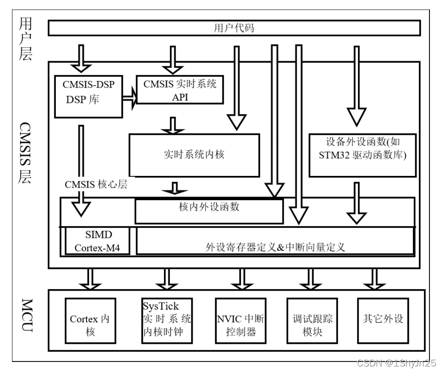

# STM32

## CMSIS标准

为了解决不同厂商生产的Cortex微控制器软件的兼容性问题，ARM与芯片厂商建立了CMSIS标准(Cortex MicroController Software Standard)，其架构如图。



*CMSIS架构*

## STM32开发方式

## 工程文件创建

### 寄存器版本

#### 工程结构解读

1. startup_stm32f10x_hd.s

* 初始化
* 设置堆、栈大小
* 配置SRAM作为数据储存器
* 调用SystemInit()
* 设置C库的分支入口"__main"

#### 创建过程
参见《STM32库开发实战指南》第6章

#### 遇到的bug

1. test.axf: Error: L6218E: Undefined symbol SystemInit (referred from startup_stm32f10x_hd.o).`

方法一：在main.c文件中添加SystemInit空函数
```
void SystemInit(void){
}
```

方法二：在startup_stm32f10x_hd.s文件中搜索一下SystemInit，找到一下代码，并将其中三句省略
```
Reset_Handler PROC
EXPORT Reset_Handler [WEAK]
IMPORT __main
;IMPORT SystemInit
;LDR R0, =SystemInit
;BLX R0
LDR R0, =__main
BX R0
ENDP
```
前提是比较简单的小工程不需要用到SystemInit,如果要用到SystemInit的话还是要在合适的位置加上SystemInit的函数定义。

2. Error: L6218E: Undefined symbol main (referred from entry9a.o)

第一种情况：如果main函数书写时出错，把main写mian；

第二种情况：如果在建立工程时未把main.c或是写main函数的文件添加到工程文件；

第三种情况：未编写main函数时也会出现。

### 标准库版本（固件库版本）

#### 工程文件结构


## 参考文献

[1] [CSDN:No.2 STM32F429IGT6 固件库 CMSIS标准及库和STM32官方文档资料总结 （STM32F429/F767/H743）](https://blog.csdn.net/weixin_51218153/article/details/123465937?ops_request_misc=%257B%2522request%255Fid%2522%253A%2522164953031416780269846659%2522%252C%2522scm%2522%253A%252220140713.130102334.pc%255Fall.%2522%257D&request_id=164953031416780269846659&biz_id=0&utm_medium=distribute.pc_search_result.none-task-blog-2~all~first_rank_ecpm_v1~rank_v31_ecpm-12-123465937.142^v7^control,157^v4^control&utm_term=CMSIS%E6%9E%B6%E6%9E%84STM32&spm=1018.2226.3001.4187)