# STM32片上外设

## 通用外设
### GPIO
#### GPIO简介
GPIO，全称 通用输入输出（General Purpose Input/Output）。通过GPIO我们得以将STM32与外部设备的连接以实现各种功能。

#### 工作原理及工作模式
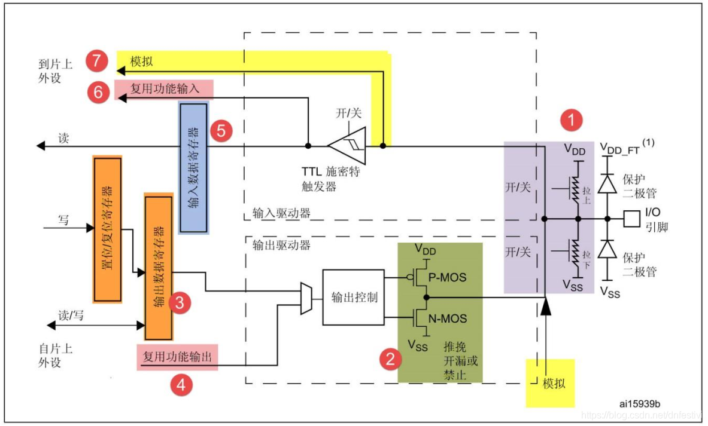

*GPIO硬件框图*

1. 上下拉电阻
    
    通过控制上下拉电阻改变该引脚电压的默认电平
    ```
    上拉(Pull-up): 高电平
    下拉(Pull-down): 低电平
    浮空(No pull-up and no pull-down): 不定电平
    ```
    这里需注意,由于上下拉电阻的供电电压由芯片内部提供，因此输出的电流很小，所以上下拉三种模式一般用于处于输入状态的引脚，而需要输出较大电流时还是需要外部上拉。

    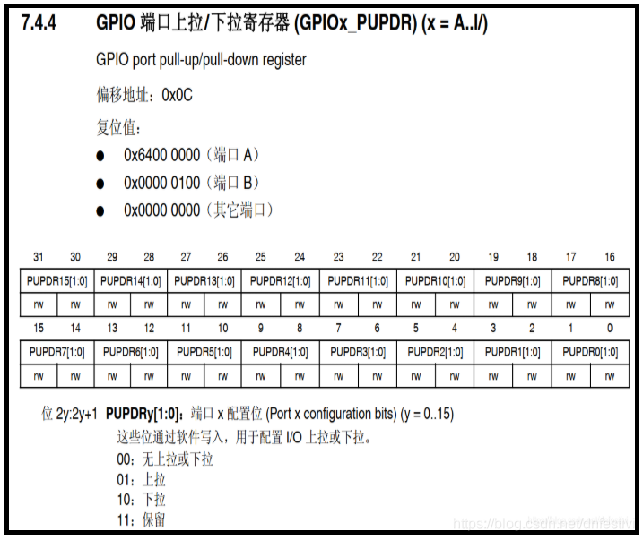
    
    *上拉/下拉寄存器GPIOx_PUPDR*


2. MOS管
    
    通过控制MOS管的通断改变该引脚的输出模式
    * 推挽输出(GPIO_Mode_Out_PP)
    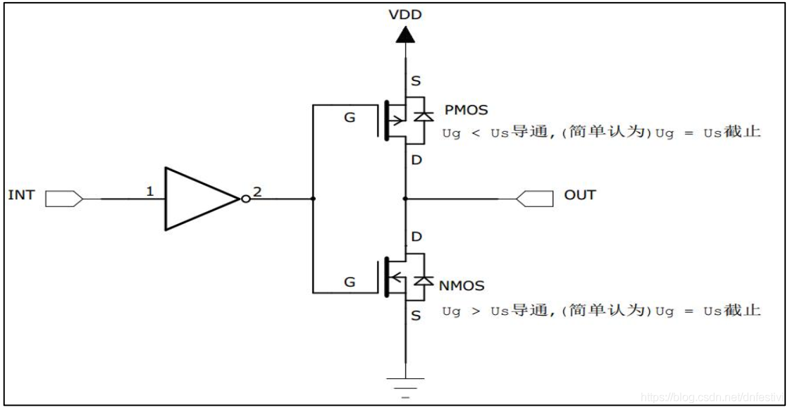

    通过配置输出寄存器控制在INT端输入高电平时，上方的P-MOS导通，下方的N-MOS关闭，对外输出高电平；而输入低电平时，经过反向后，N-MOS导通，P-MOS关闭，对外输出低电平，当引脚高低电平切换时，两个管子轮流导通，P管负责灌电流，N管负责拉电流，其负载能力和开关速度都比普通的方式有很大的提升。

    * 开漏输出
    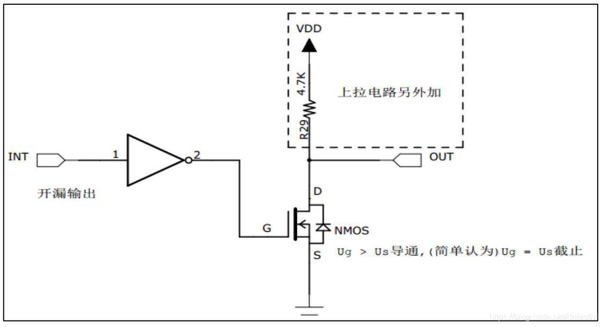

    这一模式下，上方PMOS不工作，控制INT端输出低电平，NMOS导通，输出接地；而输出高电平，NMOS关闭引脚处于高阻状态，此时电路具有“线与”特性，即只有当多个高阻态开漏输出的引脚接在一起，且外部上拉高电平时，引脚才会输出高电平，否则引脚输出低电平。另外，开漏输出还有可以应用在电平不匹配的情况，比如外部上拉电源5V。
    
    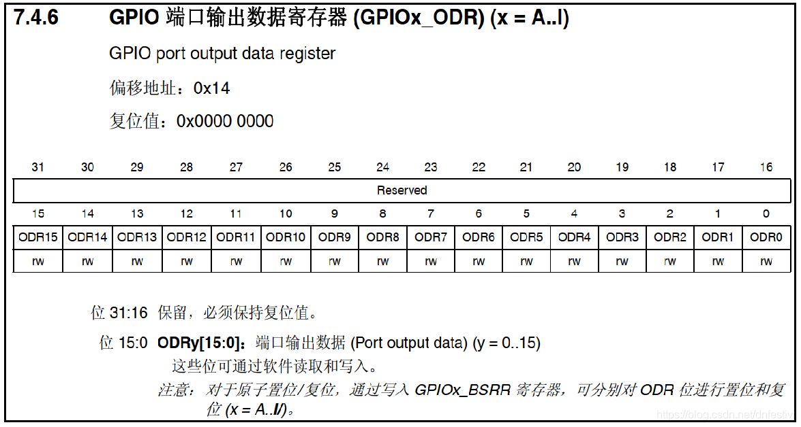
    
    *输出数据寄存器GPIOx_ODR*

    

    *置位/复位寄存器GPIOx_BSRR*

    对于输出数据寄存器，我们又通过修改置位/复位寄存器修改输出数据寄存器的值。


3. 施密特触发器

    施密特触发器也称肖特基触发器，

4. 复用功能输出
    
    STM32的其他片上外设对GPIO引脚进行控制，此时GPIO引脚用作该外设的一部分，作第二用途使用。例如，我们在使用UART串口通讯时，就会将GPIO引脚复用为UART，并通过配置UART的寄存器控制该引脚。

5. 复用功能输入
    
    与复用功能输出类似

6. 模拟输入输出
    
    该引脚用作模拟输入功能时，输入的信号不经过施密特触发器（一种电压比较器），即输入到片上的信号为模拟信号，我们常用于ADC采集信号；而用于模拟输出功能时，输出的信号不经过双MOS管结构，直接将模拟信号输出至引脚。值得注意的是，引脚作为模拟输入输出时，引脚的上下拉电阻失效。

7. 中断输入

#### 实际操作
1. 寄存器操作
    
    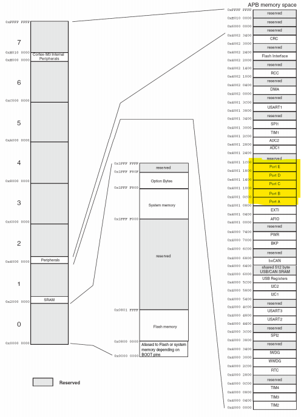
    
    *stm32存储器映像*

    GPIO外设，修改端口高低控制寄存器GPIOx_CRH和GPIOx_CRL可以配置每个GPIO的工作模式和速度，每四位控制一个IO，CRL控制端口的低8位，CRH控制端口的高8位

    

    *端口配置低寄存器GPIOx_CRL*

    

    *端口配置高寄存器GPIOx_CRH*

2. 标准库操作
    
    ```c
    /* GPIO初始化结构体参数 stm32f1x_gpio.h */
    typedef enum
    { 
      GPIO_Speed_10MHz = 1,
      GPIO_Speed_2MHz, 
      GPIO_Speed_50MHz
    }GPIOSpeed_TypeDef;

    typedef enum
    { GPIO_Mode_AIN = 0x0,              //模拟输入
      GPIO_Mode_IN_FLOATING = 0x04,     //浮空输入
      GPIO_Mode_IPD = 0x28,             //下拉输入
      GPIO_Mode_IPU = 0x48,             //上拉输入
      GPIO_Mode_Out_OD = 0x14,          //开漏输出
      GPIO_Mode_Out_PP = 0x10,          //推挽输出
      GPIO_Mode_AF_OD = 0x1C,           //复用开漏输出
      GPIO_Mode_AF_PP = 0x18            //复用推挽输出
    }GPIOMode_TypeDef;

    typedef struct
    {
      uint16_t GPIO_Pin;                //结构体元素1：GPIO_Pin
      GPIOSpeed_TypeDef GPIO_Speed;     //结构体元素3: GPIO_Speed
      GPIOMode_TypeDef GPIO_Mode;       //结构体元素2：GPIO_Mode
      }GPIO_InitTypeDef;
    ```

    ```c
    /* 初始化GPIO引脚 */
    GPIO_InitTypeDef  GPIO_InitStructure;                   //开启GPIO初始化的结构体

    RCC_APB2PeriphClockCmd(RCC_APB2Periph_GPIOC, ENABLE);   //使能APB2下的PORTC端口时钟
	
    GPIO_InitStructure.GPIO_Pin = GPIO_Pin_13;               //PC13端口配置
    GPIO_InitStructure.GPIO_Mode = GPIO_Mode_Out_PP;        //配置为推挽输出
    GPIO_InitStructure.GPIO_Speed = GPIO_Speed_50MHz;       //设置IO口速度为50MHz
    GPIO_Init(GPIOC, &GPIO_InitStructure);                  //结构体根据设定参数初始化GPIOC13
    ```

    ```c
    /* GPIO操作 */
    GPIO_SetBits(GPIOC,GPIO_Pin_13);	                        //PC13 输出高
    GPIO_ResetBits(GPIOC,GPIO_Pin_13);	                        //PC13 输出低
    ```

3. HAL库操作
   
   * Cube端配置

    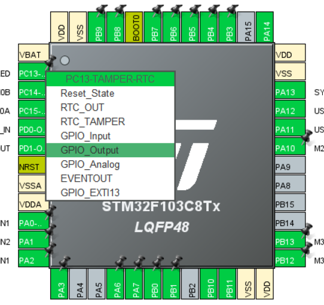
    
    *引脚开启*

    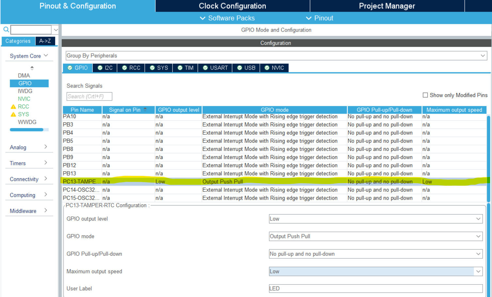
    
    *引脚配置*

    ```
    output level //引脚输出电平
    mode //引脚输出模式（开漏/推挽）
    Pull-up/Pull-down //拉高/拉低
    output speed //IO口速度
    ```

<div STYLE="page-break-after: always;"></div>

### NVIC&EXTI
#### NVIC简介及EXTI概念引入
NVIC全称是Nested vectoredinterrupt controller，即嵌套向量中断控制器。

* 什么是“中断"？什么是中断服务函数？

    我们可以将中断从字面意思上理解，就是A程序被另外一个事件打断不再进行而去执行B程序。
    
    以饭馆吃饭为例，使用中断就是饭做好了，服务员会为你端上来，然后你开始吃饭（程序B），这种情况下服务员端上来之前你爱干啥就干啥（程序A）；但如果不使用中断，你需要一次一次去问服务员饭做好了没有，这期间你没办法去做其他事情。
    ```c
    伪代码如下：
    /*不使用中断*/
    while(1){
        （询问服务员饭做好了没）
        if (饭做好了){
            （吃饭）
        }
    }
    /*使用中断*/
    [设置中断]（如果服务员把饭端上来了就进入中断服务函数）

    while{
        （干别的事）
    }

    （中断服务函数）
    ```
    那么理解了中断之后，我们再研究NVIC，即将不同的中断进行嵌套，并且与向量一样，有大小和方向，我们可以理解为配置每个中断的优先级。

* 中断的类型
    
    在微控制器中，我们将中断分为两种：芯片内核产生的中断，称为异常，也称内核中断；而芯片片上外设产生的中断称为外部中断，比如GPIO引脚电平变化、定时器溢出等。

    NVIC与Cortex-M内核有着密不可分的联系，然而基于内核发挥作用的STM32片上外设不需要用上Cortex-M内核高达256种的中断类型。如STM32F1的小、中、大容量产品就仅仅有10个内核中断和60个外部中断，如图为STM32F1的10个内核中断。在这里我们可以理解为优先级数值越小，该中断的优先级越高，也即当多个中断发生时系统需先处理优先级高的中断。

    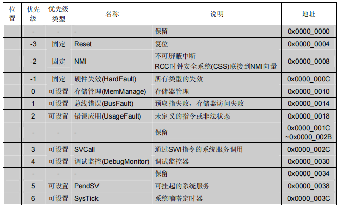

    *STM32F10xxx产品(小容量、中容量和大容量)的内核中断向量表*

    对于内核中断，从图中我们可以看到，除了前三个异常以外，剩下的异常都可以直接通过NVIC进行控制（NVIC的控制原理参考《Cortex-M3内核编程手册》）

    对于外部中断，我们又分为两类：一类其中断源来自外部引脚GPIO或复用的外部引脚AFIO，我们用外部中断/事件控制器(EXTI)进行控制；另一类为中断源来自不挂载在GPIO下的引脚。

    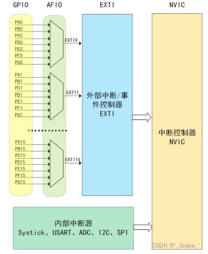

    *外部中断类型*
    *注：此处的内部中断源包括了可编程的内核中断systick和非GPIO中断，其中的systick不属于外部中断，不要被图片误导*

#### EXTI工作原理

综上述，我们知道了EXTI，全称External interrupt/event controller，即外部中断/事件控制器。

* 那么NVIC和EXTI到底有什么作用，又有什么不一样呢？
    
    作为STM32的两大中断管理器。首先，他们都有共同的功能：中断使能和挂起位查询，但他们管辖的范围不同；其次，NVIC还有一重要功能————优先级管理。
    
    我们可以举一个不恰当的例子来描述内核、NVIC、EXTI、外设之间的关系：大臣相当于外设，奏折相当于外设的中断/事件，太监相当于NVIC，皇帝相当于内核。大臣写了个奏折通过太监上报给皇帝进行处理。

* 什么是中断使能和挂起位查询？
    
    继续沿用那个“不恰当的例子”，EXTI使能就是大臣写了奏折，NVIC使能就是太监上报奏折给了皇上。而如果大臣意识到问题（中断信号）后却没有写奏折，或太监把奏折扣留了，则称为把中断挂起。
    
    在芯片内部，我们使能多个中断，如果中断发生时，正在处理同级或高优先级异常，或者被掩蔽，则中断不能立即得到响应，此时中断被挂起。挂起意味着等待而不是舍去，当优先级高的或者同级先发生的中断完成后，被挂起的中断才会执行。中断的挂起状态可以通过“中断设置挂起寄存器(SETPEND)”和“中断挂起清除寄存器(CLRPEND)”来读取，还可以手动挂起中断。

下面我们研究这一控制器是如何工作的。

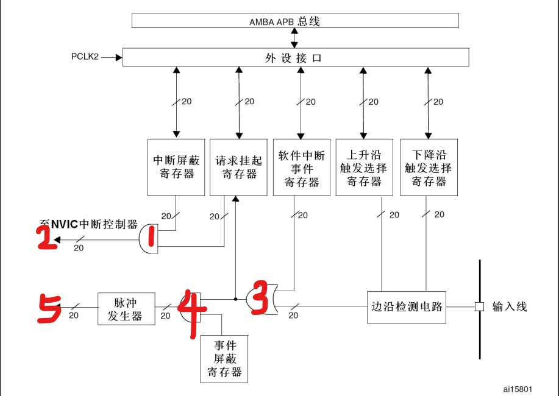

*STM32F1的EXTI硬件框图*

EXTI具有两大功能：产生中断与产生事件。

* 中断和事件的区别？
    
    如之前提及的，产生中断的目的是把输入信号输入到NVIC中断控制器中，进一步执行中断服务函数，实现功能，这是软件级别的。而产生事件的目的是传输一个脉冲信号给其他外设使用，这是电路级别的信号传输，属于硬件级别的，比如可以给定时器TIM或者ADC等使用。

我们可以将最终传至NVIC的中断类型分为两种：

1. 输入信号配置为上升沿或下降沿触发
   
   当信号进入边沿检测电路，该电路由上升沿触发选择寄存器(EXTI_RTSR)和下降沿触发选择寄存器(EXTI_FTSR)配置该电路由上升沿还是下降沿触发中断标志位置1，继而电平信号和软件事件寄存器共同作为输入，进入3的“或门”电路，此时软件中断事件寄存器(EXTI_SWIER)不做配置置0，中断信号进入请求挂起寄存器(EXTI_PR)，若没有同级或高优先级中断，或者被掩蔽，则继续进入1的“与门”电路；若不操作中断屏蔽寄存器屏蔽特定中断，则置位为1，4处“与门”电路导通，中断电平信号输出到NVIC。
2. 输入线设定为事件
   
   边缘检测电路前同上述一致，但进入3的“或门”电路，通过配置软件中断事件寄存器(EXTI_SWIER)，将中断信号设置为某事件，若此事件发生，则电平信号继续进入4的“与门”电路；若不操作事件屏蔽寄存器屏蔽特定事件，则置位为1，4处“与门”电路导通，事件电平信号控制脉冲发生器产生脉冲至片上其他外设。


综上，我们可以看出边沿检测电路的作用是用于检测信号的上升沿和下降沿，3处“或门”电路适用于检测事件发生与否，4处“与门”电路用于屏蔽特定事件，1处“与门”电路用于屏蔽特定中断。


#### 实际操作
无论是哪一种操作，我们首先都要明确两个概念：优先级和优先级分组
1. 优先级：抢占优先级和子优先级

    Cortex-M3将其利用NVIC中的中断优先级寄存器(NVIC_IPRx)将优先级分为0-255共8位，数值越低，优先级越高。但多数芯片不采用全部位数，比如STM32F103只用了高四位，这四位优先级又被分为抢占优先级和子优先级（响应优先级）。对于多个中断，先比较抢占优先级，若一致再比较子优先级，若优先级都相同，则比较硬件中断编号。

2. 优先级分组
    
    根据项目对不同抢占优先级和子优先级的不同需求，标准库又建立了优先级分组，由内核外设SCB的应用程序中断和复位控制寄存器(AIRCR)的PRIGROUP[10:8]位决定。比如STM32F103将4位的优先级分为16bits：

    NVIC_PriorityGroup_0：0bit抢占优先级，16bits子优先级；

    NVIC_PriorityGroup_1：2bits抢占优先级，8bits子优先级；

    NVIC_PriorityGroup_2：4bits抢占优先级，4bits子优先级；

    NVIC_PriorityGroup_3：8bits抢占优先级，2bits子优先级；

    NVIC_PriorityGroup_4：16bits抢占优先级，0bits子优先级；

* NVIC
  1. 寄存器操作

  2. 标准库操作
    ```c
    /*NVIC优先级分组配置 misc.h*/
    void NVIC_PriorityGroupConfig(uint32_t NVIC_PriorityGroup);
    //优先级分组参数
    #define NVIC_PriorityGroup_0         ((uint32_t)0x700)
    #define NVIC_PriorityGroup_1         ((uint32_t)0x600)
    #define NVIC_PriorityGroup_2         ((uint32_t)0x500)
    #define NVIC_PriorityGroup_3         ((uint32_t)0x400)
    #define NVIC_PriorityGroup_4         ((uint32_t)0x300)

    /* NVIC初始化结构体参数 misc.h */
    typedef struct{
        uint8_t NVIC_IRQChannel;                    //NVIC中断源
        uint8_t NVIC_IRQChannelPreemptionPriority;  //NVIC抢占优先级
        uint8_t NVIC_IRQChannelSubPriority;         //NVIC子优先级
        FunctionalState NVIC_IRQChannelCmd;         //NVIC使能与否
    } NVIC_InitTypeDef;
    /*NVIC_IRQChannel中断源成员 stm32f10x.h*/
    typedef enum IRQn
    {
        /*内核异常*/
        NonMaskableInt_IRQn         = -14,
        MemoryManagement_IRQn       = -12,
        BusFault_IRQn               = -11,
        UsageFault_IRQn             = -10,
        SVCall_IRQn                 = -5,
        DebugMonitor_IRQn           = -4,
        PendSV_IRQn                 = -2,
        SysTick_IRQn                = -1,
        
        /*外部中断（部分）*/
        WWDG_IRQn                   = 0,
        PVD_IRQn                    = 1,
        //...
    }IRQn_Type;
    /*使能参数 stm32f10x.h*/
    typedef enum {DISABLE = 0, ENABLE = !DISABLE} FunctionalState;
    ```

    ```c
    /* NVIC初始化操作 */
    NVIC_InitTypeDef NVIC_InitStructure;                        //开启NVIC初始化结构体

    NVIC_PriorityGroupConfig(NVIC_PriorityGroup_1);             //设置NVIC优先级分组为Group_1

    NVIC_InitStructure.NVIC_IRQChannel = EXTI0_IRQn;            //配置中断源为EXTI0
    NVIC_InitStructure.NVIC_IRQChannelPreemptionPriority = 1;   //设置其抢占优先级为1
    NVIC_InitStructure.NVIC_IRQChannelSubPriority = 1;          //设置其子优先级为1
    NVIC_InitStructure.NVIC_IRQChannelCmd = ENABLE;             //使能中断通道

    NVIC_Init(&NVIC_InitStructure);                             //初始化NVIC
    ```

    ```c
    /*其他NVIC操作 core_cm3.h*/
    NVIC_EnableIRQ(EXTI0_IRQn);
    NVIC_DisableIRQ(EXTI0_IRQn);
    NVIC_SetPendingIRQ(EXTI0_IRQn);
    NVIC_SetPriority(EXTI0_IRQn,  (1<<__NVIC_PRIO_BITS) - 1));
    /*(1<<__NVIC_PRIO_BITS)-1)这个参数即抢占先优先级值,
    其中__NVIC_PRIO_BITS是stm32.h中的宏定义，库函数默认为4，表示用4位表示占先优先级，
    因为m3内核只有4位用来表示占先优先级和响应优先级，
    那么响应优先级就剩下0位了，也就是没有响应优先级之分。
    按照上式计算若NVIC_PRIO_BITS为4则占先优先级为15，
    即最低优先级值依次可类推，
    即 (1<<__NVIC_PRIO_BITS)-1)表示的是可用的最低优先级（1<<4为16，—1为15），
    将后面那个“1”改为其他值即可改变此模块抢占先优先级*/
    ```

  3. HAL库操作

    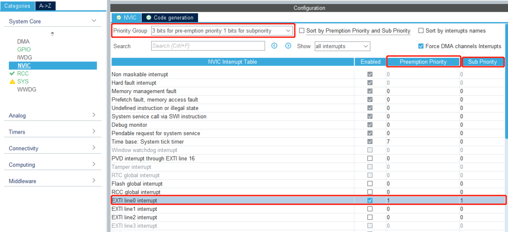

    ```
    PriorityGroup       //优先级分组
    PreemptionPriority  //抢占优先级
    SubPriority         //子优先级
    ```

* EXTI
    
    1. 寄存器操作

        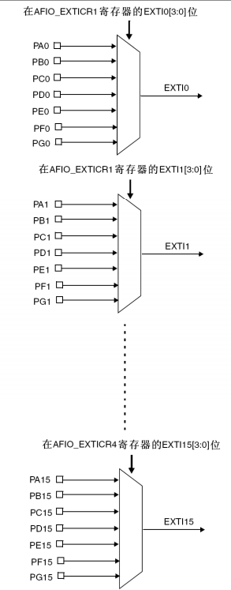

        *STM32F1系例通用IO外部中断源映像*

        ```c
        #define EXTI_Line0       ((uint32_t)0x00001)
        #define EXTI_Line1       ((uint32_t)0x00002)
        #define EXTI_Line2       ((uint32_t)0x00004)
        #define EXTI_Line3       ((uint32_t)0x00008)
        #define EXTI_Line4       ((uint32_t)0x00010)
        //...
        ```

    2. 标准库操作
        ```c
        /*GPIO中断信号源选择 stm32f10x_gpio.h*/
        //信号源选择函数
        void GPIO_EXTILineConfig(uint8_t GPIO_PortSource, uint8_t GPIO_PinSource);
        
        //GPIO_PortSource
        #define GPIO_PortSourceGPIOA       ((uint8_t)0x00)
        #define GPIO_PortSourceGPIOB       ((uint8_t)0x01)
        #define GPIO_PortSourceGPIOC       ((uint8_t)0x02)
        //...

        //GPIO_PinSource
        #define GPIO_PinSource0            ((uint8_t)0x00)
        #define GPIO_PinSource1            ((uint8_t)0x01)
        #define GPIO_PinSource2            ((uint8_t)0x02)
        #define GPIO_PinSource3            ((uint8_t)0x03)
        //...


        /*EXTI初始化结构体 stm32f10x_exti.h*/
        typedef struct
        {
            uint32_t EXTI_Line;                 //中断源
            EXTIMode_TypeDef EXTI_Mode;         //EXTI模式
            EXTITrigger_TypeDef EXTI_Trigger;   //EXTI触发类型
            FunctionalState EXTI_LineCmd;       //EXTI中断使能
        }EXTI_InitTypeDef;

        typedef enum
        {
            EXTI_Mode_Interrupt = 0x00,     //中断
            EXTI_Mode_Event = 0x04          //事件
        }EXTIMode_TypeDef;
        typedef enum
        {
            EXTI_Trigger_Rising = 0x08,         //上升沿触发
            EXTI_Trigger_Falling = 0x0C,        //上升沿触发
            EXTI_Trigger_Rising_Falling = 0x10  //上升沿触发
        }EXTITrigger_TypeDef;

        /*stm32f1高容量的中断服务函数 startup_stm32f10x_hd.s*/
        __Vectors   DCD     RCC_IRQHandler
                    DCD     EXTI0_IRQHandler
                    DCD     EXTI1_IRQHandler
                    DCD     EXTI2_IRQHandler
                    DCD     EXTI3_IRQHandler
                    DCD     EXTI4_IRQHandler
                    DCD     DMA1_Channel1_IRQHandler 
        /*DCD是一条数据定义伪指令，用于分配一片连续的字存储单元并用指定的数据初始化。
        当发生中断（异常）时，该异常被Cortex-M3内核接受，对应的异常Handler就会执行。
        而这个响应过程都是硬件来完成的，
        为了决定Handler的入口地址，Cortex-M3使用了“向量表查表机制”。
        startup_stm32f10x_md.s启动文件已经为每个中断服务函数赋予了该地址，
        所以在异常发生后，CPU进入异常模式，
        同时程序计数器PC自动指向异常入口地址，也就是中断服务函数，
        进而执行中断服务函数中的应用，执行完之后再回到主函数继续执行。*/
        ```

        ```c
        /*外部中断初始化*/
        /*开启需要的初始化结构体*/
        NVIC_InitTypeDef NVIC_InitStructure;
        GPIO_InitTypeDef GPIO_InitStruct;
        EXTI_InitTypeDef EXTI_InitStruct;

        /*开启GPIO时钟*/
        RCC_APB2PeriphClockCmd(RCC_APB2Periph_GPIOC, ENABLE);

        /*NVIC初始化*/
        NVIC_PriorityGroupConfig(NVIC_PriorityGroup_1);
        NVIC_InitStructure.NVIC_IRQChannel = EXTI0_IRQn;
        NVIC_InitStructure.NVIC_IRQChannelPreemptionPriority = 1;
        NVIC_InitStructure.NVIC_IRQChannelSubPriority = 1;
        NVIC_InitStructure.NVIC_IRQChannelCmd = ENABLE;
        NVIC_Init(&NVIC_InitStructure);

        /*GPIO初始化*/
        GPIO_InitStructure.GPIO_Pin = GPIO_Pin_0;
        GPIO_InitStructure.GPIO_Mode = GPIO_Mode_IN_FLOATING;
        GPIO_Init(GPIOC, &GPIO_InitStructure);

        /*EXTI初始化*/
        GPIO_EXTILineConfig(GPIO_PortSourceGPIOA, GPIO_PinSource0); //输入信号源为PA0
        EXTI_InitStruct.EXTI_Line = EXTI_Line0;                     //中断源为EXTI0
        EXTI_InitStruct.EXTI_Mode = EXTI_Mode_Interrupt;            //设置为中断触发
        EXTI_InitStruct.EXTI_Trigger = EXTI_Trigger_Rising;         //设置为上升沿触发
        EXTI_InitStruct.EXTI_LineCmd = ENABLE;                      //使能EXTI中断
        EXTI_Init(&EXTI_InitStruct);                                //初始化EXTI
        ```

        ```
        /*EXTI中断服务函数*/
        void EXTI0_IRQHandler(void){
            //判断产生EXTI0的中断与否
            if (EXTI_GetITStatus(EXTI_Line0) != RESET){
                
                //中断服务函数应用

                EXTI_ClearITPendingBit(EXTI_Line0); //清除EXTI0的中断标志位
            }
        }
        ```

    3. HAL库操作

        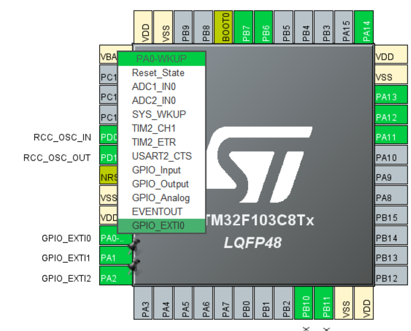
        
        *引脚配置*

        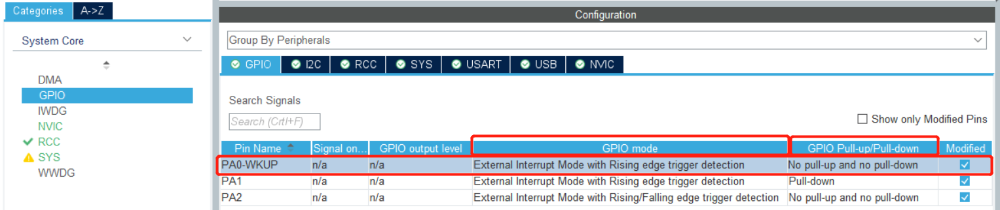

        *中断模式;触发模式配置*

        ```
        GPIO_Mode //中断/事件触发;上升沿下降沿触发
        ```

        ```c
        /*中断回调函数*/
        void HAL_GPIO_EXTI_Callback(uint16_t GPIO_Pin){
            if(GPIO_Pin == GPIO_PIN_0){
                if(HAL_GPIO_ReadPin(GPIOA, GPIO_PIN_0)==0){
                    //中断回调函数应用
                }
            }
        }
        /*这里有两点需要注意：
        第一，HAL中已经把本该是我们要去清除的标志位给清除了，
        也就是说，我们在使用STM32CubeMX开发的过程中，
        使用的任何中断都不需要去关心标志位的问题；
        第二，此时中断的优先级高于systick，
        而HAL_Delay()是由systick提供的时钟，
        因此如果要在中断回调函数中使用此函数，
        需使该中断的优先级低于systick的优先级*/
        ```


<div STYLE="page-break-after: always;"></div>

## 通信外设

单片机之间的数据传输，称为通信。我们通常将通信分为物理层和协议层：物理层规定了串口通信需要具备的电气特性(通信使用的电平标准)和机械特性(硬件连接的接口线)；协议层规定了数据包的内容，它由启始位、主体数据、校验位以及停止位组成，通讯双方的数据包格式要约定一致才能正常收发数据[<sup>3</sup>](#refer3)。因此，如果我们需要使用某一种协议进行通信，只要使用GPIO在特定的引脚上（物理层）以协议规定的信号时序要求进行输入输出控制，就可以实现基于该协议的通信，这种方式称为“软件模拟协议”。STM32中有专门的片上外设负责不同协议的通信，我们可以直接操作该外设的寄存器，实现基于该协议的通信，这种方式我们称为“硬件协议”，下面分别介绍USART、I2C、CAN等硬件协议通信。

### UART/USART

* 串口通信

    串口通信(Serial Communication)是一种串行通信方式。

    * 物理层

        | 通信标准 | 逻辑1 | 逻辑0 | 优点 | 缺点 | 使用说明 |
        | - | - | - | - | - | - | - |
        | 5V TTL | 2.4-5V | 0-0.5V |  |  |  |
        | RS-232 | -15--3V | +3-+15V |  | 1.只允许一对一通讯；2.接口电平较高，已损坏电路芯片；3.传输速率低(异步:20Kbps)；4.机械特性造成其易受共模干扰；5.传输距离短(15m) |  |
        | RS-422 |  |  | 1.支持点对多双向通信；2.采用全双工通讯，且传输速率高(10Mbps)；3.传输距离长(1219m)； |  | 传输距离超过300m时需在传输电缆的最远端接一个终接电阻 |
        | RS-485 | +2-+6V | -6--2V | 1.多站能力:在总线上可连接128个收发器；2.传输距离长(3000m)；3.采用平衡发送、差分传输，抑制共模干扰；4.收发器具有高灵敏度；5.传输速率高(10Mbps) | 采用半双工通信，收发不能同时进行 | 常用于长距离的多点互联 |

    * 协议层

        串口通讯的数据包由发送设备通过自身的TXD接口传输到接收设备的RXD接口。数据包格式规定如下[<sup>3</sup>](#refer3)：
        
        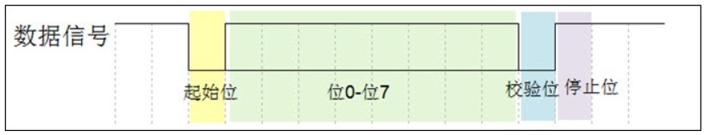 

        *串口通信数据包格式*   

        1. 波特率
            由于异步通讯中没有时钟信号，所以两个通讯设备之间需要约定好波特率，即每个码元的长度，以便对信号进行解码，如上图中用虚线分开的每一格就是代表一个码元。常见的波特率为4800、9600、115200等。

        2. 通讯的起始和停止信号
            串口通讯的一个数据包从起始信号开始，直到停止信号结束。数据包的起始信号由一个逻辑0的数据位表示，而数据包的停止信号可由0.5、1、1.5或2个逻辑1的数据位表示，只要双方约定一致即可。

        3. 有效数据
            在数据包的起始位之后紧接着的就是要传输的主体数据内容，也称为有效数据，有效数据的长度常被约定为5、6、7或8位长。

        4. 数据校验
            在有效数据之后，有一个可选的数据校验位。由于数据通信相对更容易受到外部干扰导致传输数据出现偏差，可以在传输过程加上校验位来解决这个问题。校验方法有奇校验(odd)、偶校验(even)、0校验(space)、1校验(mark)以及无校验(noparity)，它们介绍如下：

            * 奇校验要求有效数据和校验位中"1"的个数为奇数，比如一个8位长的有效数据为：01101001，此时总共有4个"1"，为达到奇校验效果，校验位为"1"，最后传输的数据将是8位的有效数据加上1位的校验位总共9位。

            * 偶校验与奇校验要求刚好相反，要求帧数据和校验位中"1"的个数为偶数，比如数据帧：11001010，此时数据帧"1"的个数为4个，所以偶校验位为"0"。

            * 0校验是不管有效数据中的内容是什么，校验位总为"0"，1校验是校验位总为"1"。

            * 在无校验的情况下，数据包中不包含校验位。

#### USART/UART简介

USART全称为通用同步异步收发器(Universal Synchronous Asynchronous Reveier and Transmitter)。

UART全称为通用异步收发器(Universal Asynchronous Reveier and Transmitter)，在USART的基础上去除了同步通信功能。

#### 工作原理

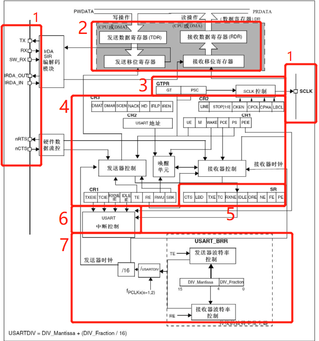

*USART工作框图*

其简化的工作原理图如下：

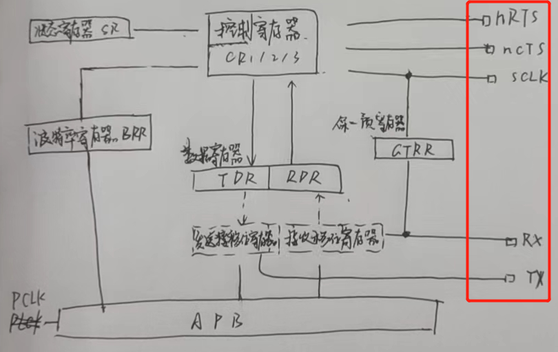

*USART简化工作框图*

(具体流程待补充！)

#### 工作模式

1. 异步(Asynchronous)

2. 同步(Synchronous)

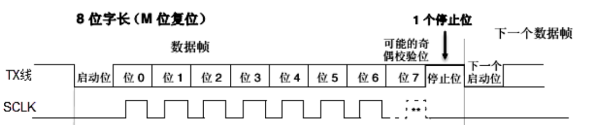

3. 半双工/单线(Half-Duplex/Single Wire)

    有些特殊场合，我们需要使用半双工，比如驱动某些数字舵机。这时数据也是双向传递，但是同一时刻只允许一个方向的数据进行传递。这种情况下只用到Tx这一根数据线。

    注：TX引脚必须设置为开漏输出且外接电阻上拉。

4. 多机通信(Multiprocessor Communication)[<sup>6</sup>](#refer6)

    利用USART可以进行多机处理器通信，其原理就是使从机处于静默模式，由主机在需要的时候发送指令唤醒从机，并传输数据。STM32静默模式特点：1、所有接收状态位都不会被设置；2、所有的接收中断都被禁止；3、USART_CR1寄存器中的RWU位被置1，RUW可以硬件自动控制或者在某些条件下由软件写。

    连接方法很简单，主机的TX输出与从机的RX端口直接相连，从机TX端口要经过与门与主机RX端口连接。

    多机通信方式有2种：空闲帧唤醒和地址唤醒。

    空闲帧唤醒可以同时唤醒所有从机，在从机处于静默模式时发送空闲帧（即所有位均为1的数据），唤醒多个从机，实现多个从机同步。

    地址唤醒可以唤醒单个从机，从机静默时发送地址帧，从机自动对比地址，地址配对正确则该从机唤醒，否则继续进入静默。这样只有被寻址者才被激活，来接收数据，减少由未被寻址的接收机器参与带来的多余的USART服务开销。这种模式下，MSB为1的字节被认为是地址，否则被认为是数据（MSB一般为数据传送的最高位，8位传送则MSB为第八位；9位传送则MSB为第九位）。在一个地址字节中，目标接收者的地址放在低4位。这4位会被接收器拿来和设置在USART_CR2寄存器中ADD位中的自身地址比较。当接收到一个和设置地址相匹配的地址字符时，RWU被清除，后面的字节将正常接收。因为RWU位已经被清除，RXEN位会因为接收到地址符被置1。当从机再次接收到地址符，如若地址不匹配则从机再次进入静默模式。

    注：从设备采用漏极开路方式级联，从设备的串口TX必须配置为漏极开路，不能是推挽方式，如果配置成推挽方式，会导致灌电流过大，低电平低不下去问题。

5. 局域互联网络(LIN)

6. 智能卡()

7. 红外线()

- 补充一种控制模式:硬件流[<sup>4</sup>](#refer4)

    数据在两个串口之间传输时，常常会出现丢失数据的现象，或者两台计算机的处理速度不同，如台式机与单片机之间的通讯，接收端数据缓冲区已满，则此时继续发送来的数据就会丢失。
    
    而流控制能解决这个问题，当接收端数据处理不过来时，就发出“不再接收”的信号，发送端就停止发送，直到收到“可以继续发送”的信号再发送数据。因此流控制可以控制数据传输的进程，防止数据的丢失。PC机中常用的两种流控制是硬件流控制（包括RTS/CTS、DTR/CTS等）和软件流控制XON/XOFF（继续/停止）。 下面介绍硬件流的控制方式。
    
    硬件流控制必须将相应的独立接口连上，用RTS/CTS（请求发送/清除发送）流控制时，应将通讯两端的RTS、CTS线对应相连，数据终端设备（如计算机）与数据通讯设备（如调制解调器）进行硬件握手。这种硬件握手方式的过程为：我们在编程时根据接收端缓冲区大小设置一个高位标志和一个低位标志，当缓冲区内数据量达到高位时，我们在接收端将CTS线置低电平，当发送端的程序检测到CTS为低后，就停止发送数据，直到接收端缓冲区的数据量低于低位而将CTS置高电平。RTS则用来标明接收设备有没有准备好接收数据。

    其实我们可以简单理解一下，在发送的时候要实时监测 CTS 的电平状态，如果发现是高电平，就不会再发送新的数据，直到 CTS 检测发现已经没有高电平信号了。[<sup>5</sup>](#refer5)(而由于检测电平与数据停止发送存在时间差，我们引入RTS。)

    软件流控是以特殊的字符来代表从机已经不能再接收新的数据了，基本的流程就是从机在接收数据很多的时候或主动给发送端发送一个特殊字符，当发送端接收到这个特殊字符后就不能再发送数据了。

    软件流控很方便，不需要增加新的硬件，还是以前的TX、RX，但是使用了软件流控，它本身的字符也是数据，这个数据只不过是说在软件里把它设置了一个特殊的含义。如果它是一个全双工的通讯，在给另一个串口发送数据的时候如果也包含了这样一个特殊字符，对方就会误以为我让它不要再发送数据了，会有一定的概率出现错误，而硬件流控就不需要考虑这方面，只需要使用 CTS 和 RTS，所有的数据都是由硬件来操作的。[<sup>5</sup>](#refer5)


#### 实际操作

1. 寄存器操作


2. 标准库操作
```c
//中断USART_IT
#define USART_IT_PE                          ((uint16_t)0x0028)
#define USART_IT_TXE                         ((uint16_t)0x0727)
#define USART_IT_TC                          ((uint16_t)0x0626)
#define USART_IT_RXNE                        ((uint16_t)0x0525)
#define USART_IT_ORE_RX                      ((uint16_t)0x0325) /* In case interrupt is generated if the RXNEIE bit is set */
#define USART_IT_IDLE                        ((uint16_t)0x0424)
#define USART_IT_LBD                         ((uint16_t)0x0846)
#define USART_IT_CTS                         ((uint16_t)0x096A)
#define USART_IT_ERR                         ((uint16_t)0x0060)
#define USART_IT_ORE_ER                      ((uint16_t)0x0360) /* In case interrupt is generated if the EIE bit is set */
#define USART_IT_NE                          ((uint16_t)0x0260)
#define USART_IT_FE                          ((uint16_t)0x0160)
```


```c
//异步全双工
    GPIO_Config(GPIOA, GPIO_Pin_9, GPIO_Mode_AF_PP); //USART1_TX设置为复用推挽输出
    GPIO_Config(GPIOA, GPIO_Pin_10, GPIO_Mode_IN_FLOATING); //USART1_RX设置为浮空输入

    //初始化USART外设时钟：USART1时钟挂载在APB2，其他的在APB1
    RCC_APB2PeriphClockCmd(RCC_APB2Periph_USART1, ENABLE); 
	
    //初始化USART
    USART_InitTypeDef USART_InitStruct; //声明必须在执行语句前
	
    USART_InitStruct.USART_BaudRate = 115200;	//配置波特率
    USART_InitStruct.USART_WordLength = USART_WordLength_8b;	//配置数据字长
    USART_InitStruct.USART_StopBits = USART_StopBits_1;	//配置停止位。
    USART_InitStruct.USART_Parity = USART_Parity_No;	//配置校验位
    USART_InitStruct.USART_HardwareFlowControl
    USART_HardwareFlowControl_None;	//关闭硬件流控制
    USART_InitStruct.USART_Mode = USART_Mode_Rx | USART_Mode_Tx;	//配置工作模式为接收和发送

    USART_Init(USART1, &USART_InitStruct);//初始化USART结构体

    NVIC_Config(USART1_IRQn, 1, 1); //串口优先级配置
    USART_ITConfig(USART1, USART_IT_RXNE, ENABLE); //使能串口中断
    USART_Cmd(USART1, ENABLE); //使能串口

    //串口发送和接收(ASCII字符)
    USART_SendData(USART1, ch);
    ch = USART_ReceiveData(USARTx);

    //中断服务函数stm32f10x_it.c
    void USART1_IRQHandler(void){
	    uint8_t temp;
	    if(USART_GetITStatus(USART1, USART_IT_RXNE)!=RESET){ //数据回显
		temp = USART_ReceiveData(USART1);
		USART_SendData(USART1, temp);
	    }
    }
```

```c
//异步半双工
    GPIO_Config(GPIOA, GPIO_Pin_9, GPIO_Mode_AF_OD); //USART1_TX设置为复用开漏输出
    //初始化USART外设时钟
    RCC_APB2PeriphClockCmd(RCC_APB2Periph_USART1, ENABLE); 
	
    //初始化USART
    USART_InitTypeDef USART_InitStruct; //声明必须在执行语句前
	
    USART_InitStruct.USART_BaudRate = 115200;	//配置波特率
    USART_InitStruct.USART_WordLength = USART_WordLength_8b;	//配置数据字长
    USART_InitStruct.USART_StopBits = USART_StopBits_1;	//配置停止位。
    USART_InitStruct.USART_Parity = USART_Parity_No;	//配置校验位
    USART_InitStruct.USART_HardwareFlowControl
    USART_HardwareFlowControl_None;	//关闭硬件流控制
    USART_InitStruct.USART_Mode = USART_Mode_Rx | USART_Mode_Tx;	//配置工作模式为接收和发送

    USART_Init(USART1, &USART_InitStruct);//初始化USART结构体

    NVIC_Config(USART1_IRQn, 1, 1); //串口优先级配置
    USART_ITConfig(USART1, USART_IT_RXNE, ENABLE); //使能串口中断
    USART_HalfDuplexCmd(USARTx, ENABLE); //使能半双工模式
    USART_Cmd(USART1, ENABLE); //使能串口

    #define readOnly(x)	x->CR1 |= 4;	x->CR1 &= 0xFFFFFFF7;		//串口x配置为只读，CR1->RE=1, CR1->TE=0
    #define sendOnly(x)	x->CR1 |= 8;	x->CR1 &= 0xFFFFFFFB;		//串口x配置为只写，CR1->RE=0, CR1->TE=1

    //stm32f10x_it.c
    void USART1_IRQHandler(void){
        uint8_t temp;
        if(USART_GetITStatus(USART1, USART_IT_RXNE)!=RESET){//数据回显
            temp = USART_ReceiveData(USART1);
            sendOnly(USART1);
            USART_SendData(USART1, temp);
        }
    }

```

```c
//多机通信
```
printf()函数实际上是一个宏，最终调用的是 fputc(int ch,FILE *f)这个函数来执行输出的，所以我们需要修改这个函数，使函数向串口输出，这样当再次引用printf()函数时，printf()就是通过串口向上位机发送数据的一个函数了。[<sup>7</sup>](#refer7)

```c
//printf、getchar重定向
#include "stdio.h"

int fputc(int ch, FILE *f)
{
	USART_SendData(USART1,  (uint8_t) ch);
	//等待发送完毕
	while (USART_GetFlagStatus(USART1, USART_FLAG_TXE) == RESET); 
	return ch;
}
int fgetc(FILE *f)
{
	//等待串口输入数据
	while (USART_GetFlagStatus(USARTx, USART_FLAG_RXNE) == RESET);

	return (int)USART_ReceiveData(USART1);
}

```


3. HAL库操作

```c
//printf重定向
//usart.h
#include "stdio.h"
//usart.c
/* USER CODE BEGIN 1 */
int fputc(int ch,FILE *f)
{
	HAL_UART_Transmit(&huart1,(uint8_t*)&ch,1,100);
	return ch;
}
/* USER CODE END 1 */
```

### I2C

I2C协议，全称集成电路总线(Inter Integrate Circuit)。

* I2C协议

    * 物理层[<sup>8<sup>](#refer8)

        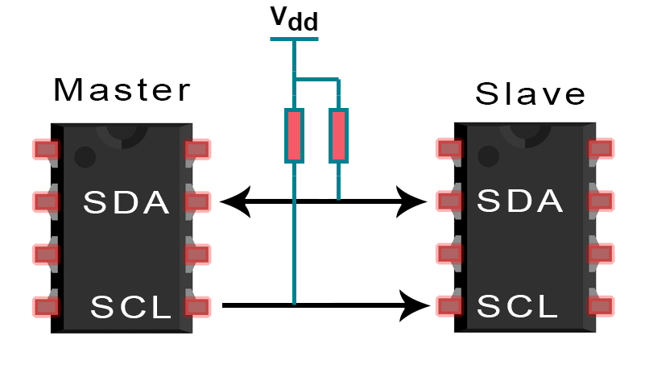

    * 协议层

        


        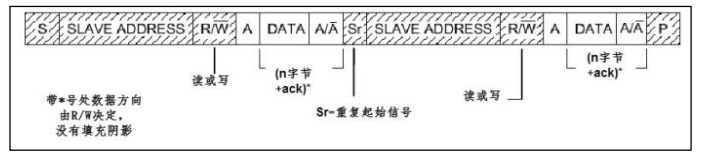


        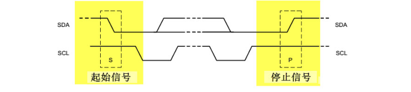

#### I2C工作原理

- 整体框图

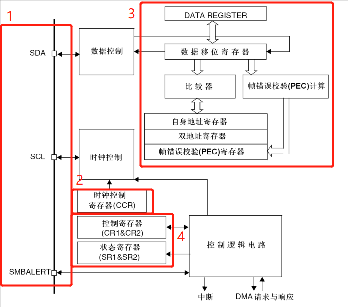

*I2C功能框图*

1. 由GPIO复用为SDA、SCL输入或输出I2C通信数据
2. 通过控制时钟控制寄存器(I2C_CCR)控制通信的时钟频率，可以设置为“标准Standard/快速Fast”两种模式，分别对应100kps、400kps两种通信速率。当设置为“快速模式”(Fast Speed)时，可以选择SCL时钟的占空比：Duty=$\frac{1}{3}$或$\frac{9}{25}$，即Tlow/Thigh=2或$\frac{16}{9}$，这一参数会影响数据的采样率。
3. 与USART一致，数据通过数据移位寄存器与数据寄存器(I2C_DR)实现互传；如果使能了数据校验，会经过PEC计算器运算，结果存入PEC寄存器(Package Error Check 包错误校验)；当工作在从机模式时，接受到地址位，会与自身地址寄存器(I2C_OAR1/I2C_OAR2)进行比较。
4. 我们通过操作控制寄存器，读取状态寄存器对I2C的整个工作流程进行控制。

注：SMBALERT是I2C支持的SMBus和SMBus2.0协议，主要应用于电池管理。


- 通信过程

1. 接收器

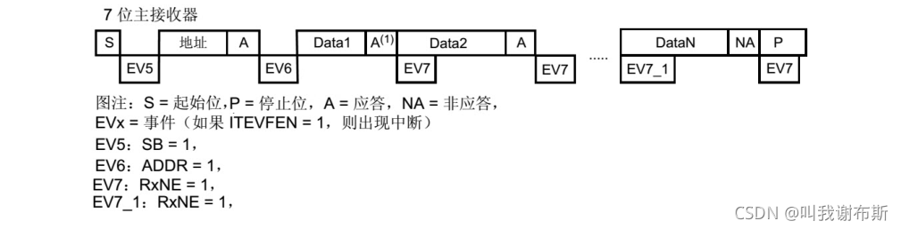

*I2C接收器时序图*

2. 发送器

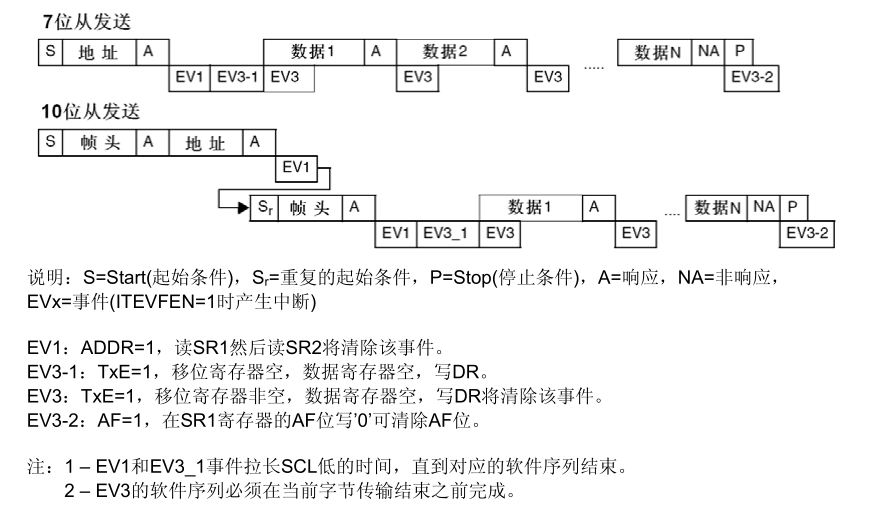

*I2C发送器时序图*

#### 实际操作

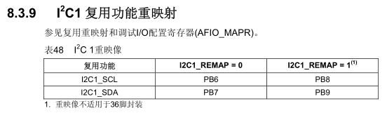

1. 寄存器操作


2. 标准库操作

```c
//I2C_mode 
#define I2C_Mode_I2C                    ((uint16_t)0x0000)
#define I2C_Mode_SMBusDevice            ((uint16_t)0x0002)  
#define I2C_Mode_SMBusHost              ((uint16_t)0x000A)

//I2C_duty_cycle_in_fast_mode 
#define I2C_DutyCycle_16_9              ((uint16_t)0x4000) /*!< I2C fast mode Tlow/Thigh = 16/9 */
#define I2C_DutyCycle_2                 ((uint16_t)0xBFFF) /*!< I2C fast mode Tlow/Thigh = 2 */

//I2C_acknowledgement
#define I2C_Ack_Enable                  ((uint16_t)0x0400)
#define I2C_Ack_Disable                 ((uint16_t)0x0000)

//I2C_acknowledged_address 
#define I2C_AcknowledgedAddress_7bit    ((uint16_t)0x4000)
#define I2C_AcknowledgedAddress_10bit   ((uint16_t)0xC000)

```

```c
//初始化I2C复用引脚
    GPIO_Config(GPIOB, GPIO_Pin_6, GPIO_Mode_AF_OD);
    GPIO_Config(GPIOB, GPIO_Pin_7, GPIO_Mode_AF_OD);

//配置I2C
    I2C_InitTypeDef I2C_InitStruct;

    I2C_InitStruct.I2C_ClockSpeed = 400000;
    I2C_InitStruct.I2C_Mode = I2C_Mode_I2C;
    I2C_InitStruct.I2C_DutyCycle = I2C_DutyCycle_16_9; 
    //若为400000，配置为最高采样率；速率为100000时，不需要配置占空比
    I2C_InitStruct.I2C_OwnAddress1 = 0x0A; //随便配
    I2C_InitStruct.I2C_Ack = I2C_Ack_Enable; //使能应答位(一般都使能)
    I2C_InitStruct.I2C_AcknowledgedAddress = I2C_AcknowledgedAddress_7bit; //配置寻址为7位

    I2C_Init(I2Cx, &I2C_InitStruct);

    I2C_Cmd(I2Cx, ENABLE);
```

```c

/*******************************I2C初始化**************************************/
void I2C_AFIO_Config(I2C_TypeDef* I2Cx){
	if(I2Cx == I2C1){
		GPIO_Config(GPIOB, GPIO_Pin_6, GPIO_Mode_AF_OD);
		GPIO_Config(GPIOB, GPIO_Pin_7, GPIO_Mode_AF_OD);
		GPIO_WriteBit(GPIOB, GPIO_Pin_6, Bit_SET);
		GPIO_WriteBit(GPIOB, GPIO_Pin_7, Bit_SET);
	}else if(I2C1 == I2C2){
		GPIO_Config(GPIOB, GPIO_Pin_10, GPIO_Mode_AF_OD);
		GPIO_Config(GPIOB, GPIO_Pin_11, GPIO_Mode_AF_OD);
		GPIO_WriteBit(GPIOB, GPIO_Pin_10, Bit_SET);
		GPIO_WriteBit(GPIOB, GPIO_Pin_11, Bit_SET);
	}
}

void I2C_Mode_Config(I2C_TypeDef* I2Cx, uint16_t I2C_Mode, uint16_t I2C_OwnAddress, int I2C_AcknowledgedAddress, uint32_t I2C_Speed_Mode){
	I2C_InitTypeDef I2C_InitStruct;
	
	I2C_InitStruct.I2C_ClockSpeed = I2C_Speed_Mode;
	I2C_InitStruct.I2C_Mode = I2C_Mode;
	if(I2C_Speed_Mode == 400000){
		I2C_InitStruct.I2C_DutyCycle = I2C_DutyCycle_16_9; //这里配置为最高采样率
	}else{//速率为100000时，不需要配置占空比
	}
	I2C_InitStruct.I2C_OwnAddress1 = I2C_OwnAddress;
	I2C_InitStruct.I2C_Ack = I2C_Ack_Enable;
	if(I2C_AcknowledgedAddress == 7){
		I2C_InitStruct.I2C_AcknowledgedAddress = I2C_AcknowledgedAddress_7bit;
	}else{
		I2C_InitStruct.I2C_AcknowledgedAddress = I2C_AcknowledgedAddress_10bit;
	}
	
	I2C_Init(I2Cx, &I2C_InitStruct);
	
	I2C_Cmd(I2Cx, ENABLE);
}

void I2C_config(I2C_TypeDef* I2Cx, uint16_t I2C_Mode, uint16_t I2C_OwnAddress, int I2C_AcknowledgedAddress, uint32_t I2C_Speed_Mode){
	I2C_AFIO_Config(I2Cx);
	I2C_Mode_Config(I2Cx, I2C_Mode, I2C_OwnAddress, I2C_AcknowledgedAddress, I2C_Speed_Mode);
}

/********************************I2C功能函数***********************************/
/**
  * @brief  发送起始信号并置位，错误码10
  * @param  I2Cx: where x can be 1 or 2 to select the I2C peripheral.
  */
void I2C_Start(I2C_TypeDef* I2Cx, uint8_t error_code){
	//产生起始信号
	I2C_GenerateSTART(I2Cx, ENABLE);
	//检测EV5事件并清除标志
	Timeout = I2C_Flag_timeout;
	while(!I2C_CheckEvent(I2Cx, I2C_EVENT_MASTER_MODE_SELECT)){
		if((Timeout--)==0){
			I2C_Timeout_DEBUG(error_code);
		}
	}
}
/**
  * @brief  发送从设备地址接受应答位并置位，错误码11
  * @param  I2Cx: where x can be 1 or 2 to select the I2C peripheral.
  * @param  Slave_Address: 从机地址.
  * @param  I2C_Direction: specifies whether the I2C device will be a
  *   Transmitter or a Receiver. This parameter can be one of the following values
  *     @arg I2C_Direction_Transmitter: Transmitter mode
  *     @arg I2C_Direction_Receiver: Receiver mode
  */
void I2C_Send_SlaveAddress(I2C_TypeDef* I2Cx, uint8_t Slave_Address, uint8_t I2C_Direction, uint8_t error_code){
	//发送从设备地址
	I2C_Send7bitAddress(I2Cx, Slave_Address, I2C_Direction);
	//检测EV6事件并清除标志
	Timeout = I2C_Flag_timeout;
	while(!I2C_CheckEvent(I2Cx, I2C_EVENT_MASTER_TRANSMITTER_MODE_SELECTED)){
		if((Timeout--)==0){
			I2C_Timeout_DEBUG(error_code);
		}
	}
}
/**
  * @brief  发送从设备寄存器地址接受应答位并置位，错误码12
  * @param  I2Cx: where x can be 1 or 2 to select the I2C peripheral.
  * @param  Slave_Address: 从机地址.
  */
void I2C_Send_RegAddress(I2C_TypeDef* I2Cx, uint8_t Reg_Address, uint8_t error_code){
	//发送从设备地址
	I2C_SendData(I2Cx, Reg_Address);
	//检测EV6事件并清除标志
	Timeout = I2C_Flag_timeout;
	while(!I2C_CheckEvent(I2Cx, I2C_EVENT_MASTER_BYTE_TRANSMITTED)){
		if((Timeout--)==0){
			I2C_Timeout_DEBUG(error_code);
		}
	}
}
/**
  * @brief  读取数据并停止
  * @param  I2Cx: where x can be 1 or 2 to select the I2C peripheral.
  * @param  pBuffer: 接收数据保存到pBuffer包中.
  * @param  NumByteToRead: 读取字节数
  * @retval 正常返回1，异常返回0.
  */
uint8_t I2C_Receive_Stop(I2C_TypeDef* I2Cx, uint8_t* pBuffer, u16 NumByteToRead, uint8_t error_code){
	while(NumByteToRead){
		if(NumByteToRead == 1){//接收到最后一个数据，发送非应答信号，结束传输
			I2C_AcknowledgeConfig(I2Cx, DISABLE); //发送非应答信号
			I2C_GenerateSTOP(I2Cx, ENABLE); //发送停止信号
		}
		Timeout = I2C_Flag_timeout*10;
		while(!I2C_CheckEvent(I2Cx, I2C_EVENT_MASTER_BYTE_RECEIVED)){
			if((Timeout--)==0){
				I2C_Timeout_DEBUG(error_code);
			}
			{
				//读取一个字节的数据
				*pBuffer = I2C_ReceiveData(I2Cx);
				pBuffer++;
				NumByteToRead--;
			}
		}
	}
	//重新使能应答
	I2C_AcknowledgeConfig(I2Cx, ENABLE);
	return 1;
}
/**
  * @brief  写入数据并停止
  * @param  I2Cx: where x can be 1 or 2 to select the I2C peripheral.
  * @param  pBuffer: 接收数据保存到pBuffer包中.
  * @param  NumByteToRead: 读取字节数
  * @retval 正常返回1，异常返回0.
  */
uint8_t I2C_Transmit_Stop(I2C_TypeDef* I2Cx, uint8_t* pBuffer, uint8_t error_code){
	I2C_SendData(I2Cx, *pBuffer);
	Timeout = I2C_Flag_timeout;
	while(!I2C_CheckEvent(I2Cx, I2C_EVENT_MASTER_BYTE_TRANSMITTED)){
		if((Timeout--)==0){
			I2C_Timeout_DEBUG(error_code);
			return 0;
		}
	}
	return 1;
}
/**
  * @brief  写入数据
  * @param  I2Cx: where x can be 1 or 2 to select the I2C peripheral.
  * @param  pBuffer: 接收数据保存到pBuffer包中.
  * @param  Slave_Address: 从机地址.
  * @param  WriteAddress: 数据写入地址.
  * @param  NumByteToRead: 读取字节数
  * @retval 正常返回1，异常返回0.
  */
uint32_t I2C_WriteByte(I2C_TypeDef* I2Cx, uint8_t Slave_Address, u8 WriteAddress, uint8_t pBuffer, uint8_t error_code){
	I2C_Start(I2Cx, error_code);
	I2C_Send_SlaveAddress(I2Cx, Slave_Address, I2C_Direction_Transmitter, error_code); //发送从设备地址
	I2C_Send_RegAddress(I2Cx, WriteAddress, error_code); //发送写入的从设备寄存器地址
	I2C_Transmit_Stop(I2Cx, &pBuffer, error_code);
	I2C_GenerateSTOP(I2Cx, ENABLE);
	return 1;
}
/**
  * @brief  读取数据
  * @param  I2Cx: where x can be 1 or 2 to select the I2C peripheral.
  * @param  MPU6050_Buffer: 接收从机的寄存器数据保存到MPU6050_Buffer中.
  * @param  Reg_Address: 数据读取地址.
  * @param  NumByteToRead: 读取字节数
  * @retval 正常返回1，异常返回0.
  */
uint8_t I2C_ReadBuffer(I2C_TypeDef* I2Cx, uint8_t Slave_Address, uint8_t Read_Address, uint8_t pBuffer, u16 NumByteToBuffer, uint8_t error_code){
	I2C_Start(I2Cx, error_code); //起始位
	I2C_Send_SlaveAddress(I2Cx, Slave_Address, I2C_Direction_Transmitter, error_code); //从设备地址，写入开始
	I2C_Cmd(I2Cx, ENABLE); //清除EV6事件
	I2C_Send_RegAddress(I2Cx, Read_Address, error_code); //读取的从设备寄存器地址
	I2C_Start(I2Cx, error_code); //读取起始位
	I2C_Send_SlaveAddress(I2Cx, 0x69, I2C_Direction_Receiver, error_code); //从设备地址，读取开始
	I2C_Receive_Stop(I2Cx, &pBuffer, NumByteToBuffer, error_code); //读取数据
	
	return 1;
}
```

```c
//调试函数，返回错误码，方便调试
#I2C_DEBUG_UART USART1
static uint32_t I2C_Timeout_DEBUG(uint8_t error_code){
	USART_SendData(I2C_DEBUG_UART, error_code);
	return 0;
}
```

3. HAL库操作

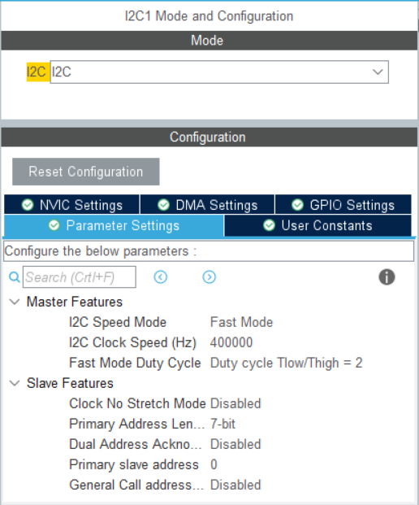

```c
//stm32f1xx_hal_i2c.h MemAddSize
#define I2C_MEMADD_SIZE_8BIT            0x00000001U
#define I2C_MEMADD_SIZE_16BIT           0x00000010U
```

```c
HAL_I2C_Init(&hi2c1);
HAL_I2C_Mem_Write(&hi2c1, Device_Address, Register_Address, I2C_MEMADD_SIZE_8BIT, &pData, 1, 0xfff);
HAL_I2C_Mem_Read(&hi2c1, Device_Address, Register_Address, I2C_MEMADD_SIZE_8BIT, &pData, 1, 0xfff);
```

### SPI

#### SPI协议简介

SPI，全称Serial Periph Interface，即串口外围设备接口，是一种高速全双工总线协议，一般用于通信速率高的场合。

- 物理层

<html>
    <table style="margin: auto">
        <tr>
            <td>
                <!--左侧内容-->
                <center>
                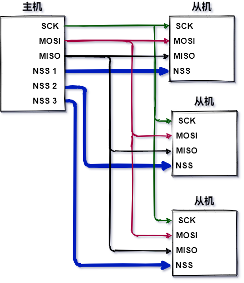
                </br>
                多NSS
            </td>
            <td>
                <!--右侧内容-->
                <center>
                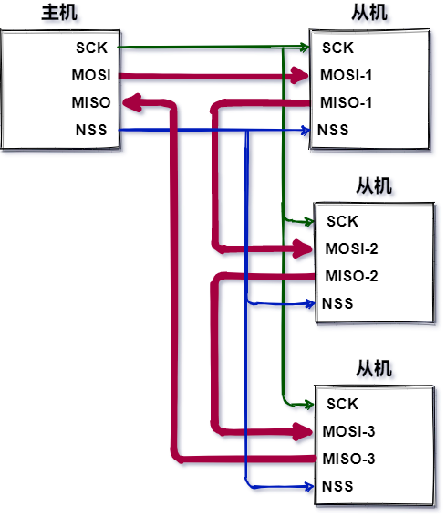
                </br>
                菊花链
            </td>
        </tr>
    </table>
</html>

SCK：同步时钟信号线，设备通讯，速率受限于低速设备。

MOSI(Master Output,Slave Input)：主设备输出，从设备输入，即从主机到从机的数据传输线。

MISO(Master Input,Slave Output)：主设备输入，从设备输出，即从机到主机的数据传输线。

NSSx[<sup>9<sup>](#refer9)：选择信号线，又称片选信号线，有多种写法如CS，$\bar {SS}$，用于寻址，即选择数据传输的从设备，一般有两种连接方式————第一种如左图所示，一个从设备对应一个NSS引脚，该方法可用于从设备较少的情况，但如果同时开启不同从设备的NSS引脚，会导致MISO引脚上数据乱码；第二种如右图所示，NSS上并联多个从设备，但数据传输引脚采用级联方式连接，由优先级高的设备先接收主机数据，再传向优先级低的设备，该方法主要应用于不同从设备之间存在数据传输优先级关系，但由于高优先级设备既作为从机，又需要承担主机功能，因此需要保证高优先级的设备稳定性。

- 协议层

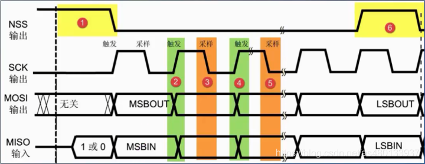

1. 起始与停止：NSS由高拉低为通信起始，当从机检测到起始信号即准备与主机通信；由低拉高为通信结束，此时从机选中状态取消。
2. 数据传输：可选择MSB或LSB先行，但通信设备间需相同，一般采用MSB先行；数据传输可为8位或16位。
3. 数据采样时刻：当时钟极性(CPOL)为0时，表示SCK空闲状态时为低电平，而CPOL=1，则相反；当时钟相位(CPHA)为0时，表示数据传输时将在SCK“级数边沿”采样，反之则在“偶数边沿”采样，如下图。

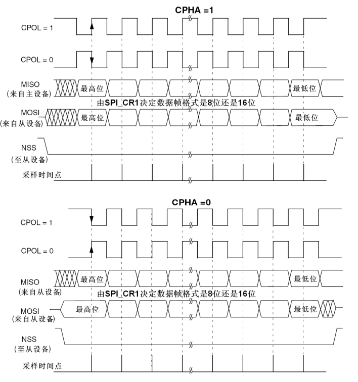

#### SPI工作原理

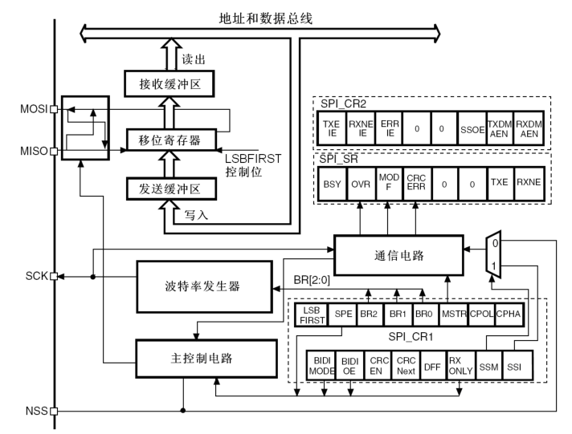

#### SPI实际操作

```
```


### DMA

<div STYLE="page-break-after: always;"></div>

## 参考文献
<div id="ref1"></div>

- [1] [USART串口协议](https://www.cnblogs.com/The-explosion/p/11587930.html)

<div id="ref2"></div>

- [2] [CSDN:串口通信基础（一）——串行与并行通信，同步与异步通信](https://blog.csdn.net/sym_robot/article/details/113182977)

<div id="ref3"></div>

- [3] [CSDN:串口通信协议简介—学习笔记](https://blog.csdn.net/chaofanzz/article/details/122557322) 

<div id="ref4"></div>

- [4] [CSDN:什么叫硬件流控制](https://blog.csdn.net/yufangbo/article/details/4087487) 

<div id="ref5"></div>

- [5] [CSDN:stm32串口USART 硬件流控](https://blog.csdn.net/weixin_44403365/article/details/109778722) 

<div id="ref6"></div>

- [6] [CSDN:STM32串口多机通信](https://blog.csdn.net/zyboy2000/article/details/7568109) 

<div id="ref7"></div>

- [7] [CSDN:STM32—重定向printf和getchar函数到串口](https://blog.csdn.net/qq_43743762/article/details/97760854) 

<div id="ref8"></div>

- [8] [CSDN:I2C协议靠这16张图彻底搞懂（超详细）](https://blog.csdn.net/u010632165/article/details/109188507) 

<div id="ref9"></div>

- [9] [CSDN:SPI协议详解（图文并茂+超详细）](https://blog.csdn.net/u010632165/article/details/109460814) 