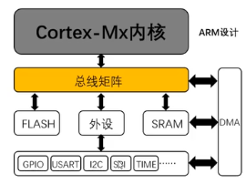
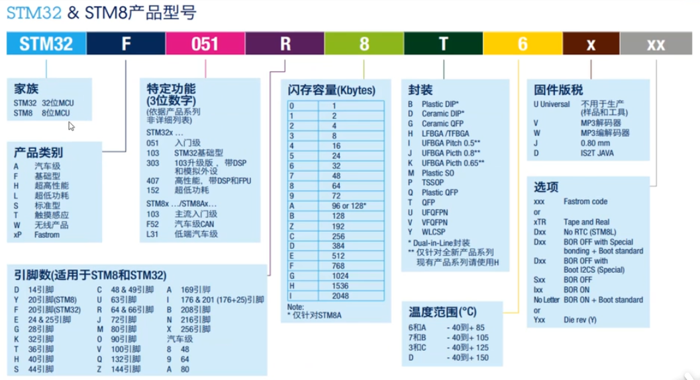
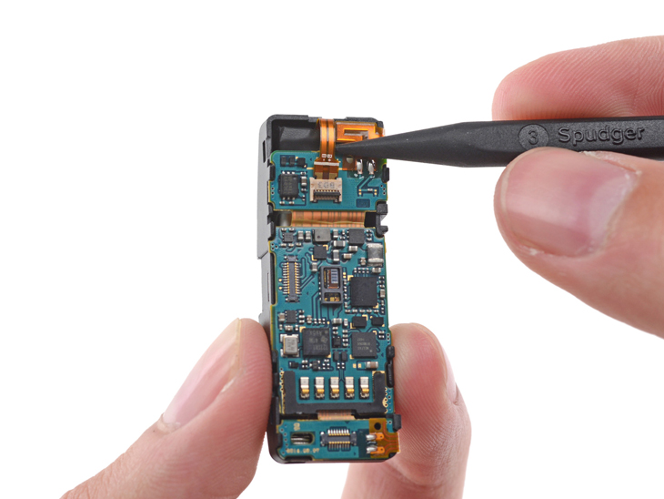
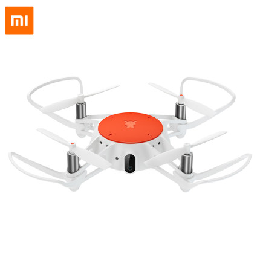
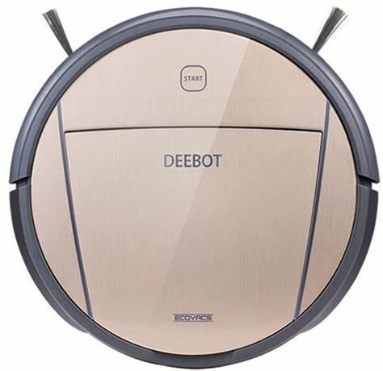

# STM32简介——常见概念扫盲
## 什么是单片机？

* 单片机（Microcontrollers）是一种集成电路芯片，是采用超大规模集成电路技术把具有数据处理能力的中央处理器CPU、随机存储器RAM、只读存储器ROM、多种I/O口和中断系统、定时器/计数器等功能（可能还包括显示驱动电路、脉宽调制电路、模拟多路转换器、A/D转换器等电路）集成到一块硅片上构成的一个小而完善的微型计算机系统，在工业控制领域广泛应用。从上世纪80年代，由当时的4位、8位单片机，发展到现在的300M的高速单片机。

* 不是完成某一个逻辑功能的芯片,而是把一个计算机系统集成到一个芯片上。相当于一个微型的计算机，和计算机相比，单片机只缺少了I/O设备。概括的讲：一块芯片就成了一台计算机。

## 什么是STM32？

STM32是意法半导体（ST）推出一款32位的单片机。
```
ST:意法半导体（芯片厂商名）
M:基于ARM平台的Cortex-M内核
32：32位微控制器（单片机）
``` 
STM32芯片内部可以粗略划分两部分：内核+片上外设。如果与电脑类比，内核与片上外设就如同电脑的CPU与主板、内存、显卡、硬盘的关系。

ARM公司只设计内核不生产芯片，他会将有关内核的技术授权给各半导体厂商例如ST、TI、Atme1、NXP等厂商。这些厂商都是基于这个内核自己设计片上外设如SRAM、ROM、FLASH、USART、GPIO等，然后集成到一个硅片上，这就是我们现在用的芯片。

  
*芯片内部架构*

## STM32选型

### 选型要求

* 内核：内核越高，功耗越高
* 引脚：引脚决定资源多少，影响价格
* 存储：RAM，FLASH越大，价格越贵
* 易购：能否买得到？这一点很重要，因为ST有一部分产品属于企业级产品，必须大批量订购
  
### 产品型号


## STM32能干什么？

STM32作为ST公司的主推的32位处理器，在民用产品领域得到观念广泛的应用。
* 智能手环
    
    
    
    *三星GearFit智能手环采用STM32F439芯片*

* 无人机
    
    
    
    *小米米兔四轴飞行器采用STM32F407芯片*

* 扫地机器人
    
    
    
    *deebot扫地机器人采用STM32F071VBT6芯片*

## 参考文献：
* STM32学习笔记（1）——概念扫盲：https://blog.csdn.net/weixin_45702091/article/details/107315129?utm_source=app&app_version=5.1.1&code=app_1562916241&uLinkId=usr1mkqgl919blen
* STM32新手入门教程：https://blog.csdn.net/xiaoshihd/article/details/110039281?utm_source=app&app_version=5.1.1&code=app_1562916241&uLinkId=usr1mkqgl919blen
* STM32 产品与选型：https://blog.csdn.net/weixin_46201756/article/details/107441584?ops_request_misc=%257B%2522request%255Fid%2522%253A%2522164722210116780255241946%2522%252C%2522scm%2522%253A%252220140713.130102334..%2522%257D&request_id=164722210116780255241946&biz_id=0&utm_medium=distribute.pc_search_result.none-task-blog-2~all~baidu_landing_v2~default-2-107441584.pc_search_result_control_group&utm_term=stm32%E4%BA%A7%E5%93%81&spm=1018.2226.3001.4187