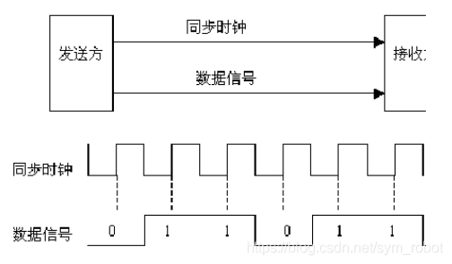
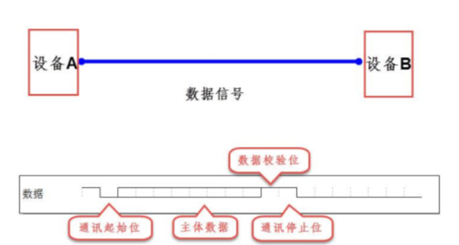
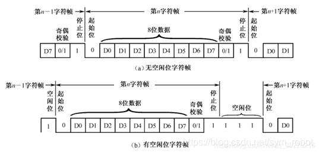

# 通信基础知识

## 通信方式

计算机数据是以多个位(bit)的二进制位形式存在，通信就是二进制位的传输。
1. 串行(点对点通信)、并行

    串行通信就是以少量数据信号线(通常为一根或一对差分信号线)，每一时刻传输一个位的数据；并行通信是指利用多根数据信号线，在同一时刻传输多个位的数据。我们可以拿公路来举例，串行通信就像单车道的公路，并行通信就像多车道的公路，而通信传输的数据就是公路上的车。

    我们对比串并行通信方式，可以得到下表：

    | 特性 | 串行通信 | 并行通信 |
    | - | :-: | :-: |
    | 通信距离 | 远 | 近 |
    | 抗干扰能力 | 强 | 弱 |
    | 传输速率 | 低 | 高 |
    | 成本 | 低 | 高 |

2. 全双工、半双工、单工

    | 通信方式 | 说明 |
    | - | - |
    | 全双工 | 两通信设备可以同时收发数据，如双向车道 |
    | 半双工 | 两通信设备具备收发数据的能力，但不可以同时进行，如单向车道 |
    | 单工 | 两通信设备，有一方固定为发送设备，一方固定为接收设备，如单行道 |

3. 同步、异步

    同步通信，正如打电话；而异步通信，正如发短信。那么控制器是如何实现这一功能的呢？

    在同步通信中，收发设备双方会使用一根信号线表示时钟信号，在时钟信号的驱动下双方进行协调，同步数据。两设备通过协议层统一规定在时钟信号的上升沿或下降沿对数据线进行采样，如下图。

    

    *同步通信*

    而异步通信则舍去了同步通信的时钟信号线，取而代之的是在数据传输中插入不同的标志位，以统一数据的传输过程

    

    *异步通信*

    

## 接口标准

接口是计算机内部或外部连接的端口，为了规范不同厂商生产的计算机接口，各大协会也为此制定了不同的接口标准。

一个接口标准由其电气特性与机械特性构成：电气特性指定接口在不同逻辑状态时的电平，“0”是几伏，“1”是几伏，信号传输方式，传输速率，传输介质，传输距离等，还要给出使用的范围，是点对点还是点对多；机械特性指定接口使用什么连接件，什么数据线，连接件的引脚定义及通信时的连接方式等[1](#refer-anchor-1)。

* 按物理电气特性划分，常用的接口类型如下[2](#refer-anchor-2)：

    1. TTL电平接口：最通用的接口类型，常用做板内及相连板间接口信号标准。信号速度一般限制在二、三十 MHz以内。驱动能力一般为几毫安到几十毫安，产品设计特别是总线设计时必须考虑负载能力。

    2. CMOS电平接口：速度范围与TTL相仿，驱动能力要弱一些。

    3. ECL电平接口：为高速电气接口，速率可达几百兆，但相应功耗较大，电磁辐射与干扰与较大。

    4. LVDS电平接口：在标准中推荐的最大操作速率是655Mbps，电流驱动模式，信号的噪声和EMI都较小。

    5. GTL接口电平：低电压，低摆幅，常用作背板总线型信号的传输，虽然使用频率一般在100MHz以下，但上升沿一般都比较陡，特别是对沿敏感的信号，如时钟信号，需要使用宽带示波器。

    6. RS-232电平接口：为低速串行通信接口标准，电平为±12V，用于DTE与DCE之间的连接。

    7. RS-422电平接口：适用于多点之间长距离高速通信，双端平衡传输方式，抗干扰能力强，可驱动10个负载，最高速率达10Mbps。典型芯片为26C31、26C32。

    8. RS-485电平接口：适用于多点之间长距离高速通信，可驱动32个负载，忍受-7V到12V共模干扰，典型芯片为SN75LBC172、SN75LBC173。

    9.  光隔离接口：能实现电气隔离，允许信号带宽一般在10M以内，更高速率的器件价格较昂贵。

    10. 线圈耦合接口：电气隔离特性好，但允许信号带宽有限

* 机械特性

## 通信协议

## 参考文献

- [1] [【第二部分】通信接口标准](https://blog.csdn.net/m0_37827925/article/details/100160680)

- [2] [常用接口标准(按物理电气特性分)](https://blog.csdn.net/kobesdu/article/details/38977689)
