# RPLIDAR A1M8初体验

## 原理
简单来说就是，激光雷达的发射机构发射结构光，碰到障碍物后反射回来，由接受机构接受，发射与接受的时间差x结构光的波速=该角度下的雷达与障碍物的距离，继而将所有角度下与障碍物的距离积分（累积）得到雷达附近的障碍物地图，如下图

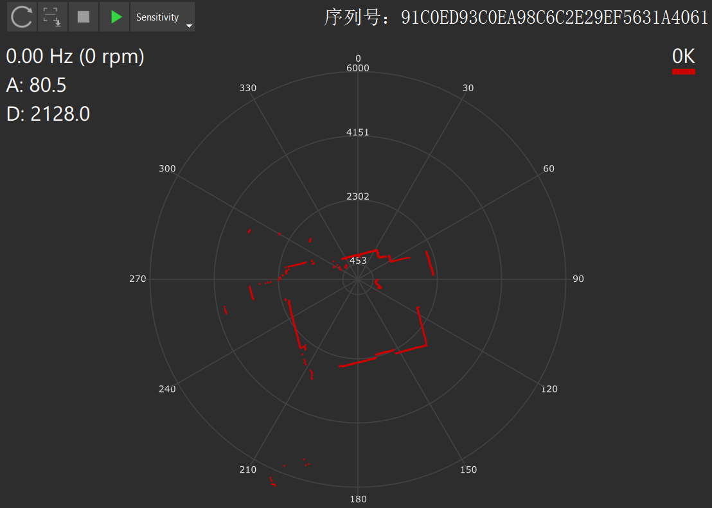

### A1M8的夹角与距离值几何定义
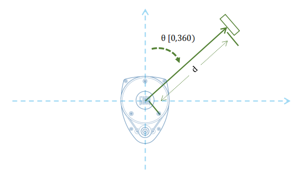

## 通讯
采用非文本形式的二进制数据报文进行，且每个数据报
文均具有统一的报头数据格式

下文将上位机发送到雷达的数据报文称为“请求”(request),雷达发送到上位机的数据报文称为“应答”(response)

### 通讯模式
1. 单次应答
   
    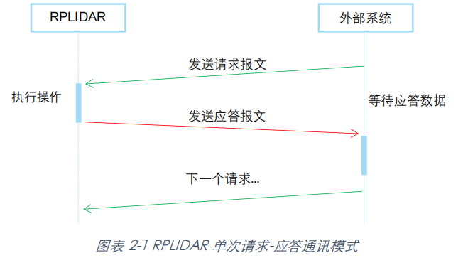
2. 多次应答（最常用）
   
   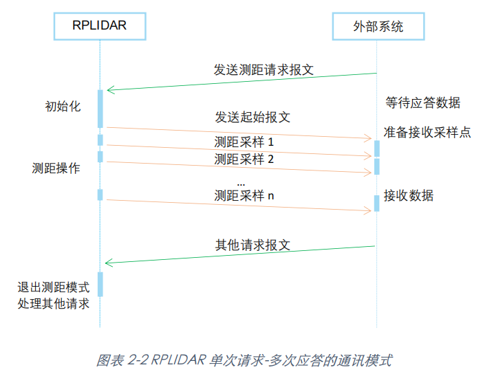
3. 无应答
   
   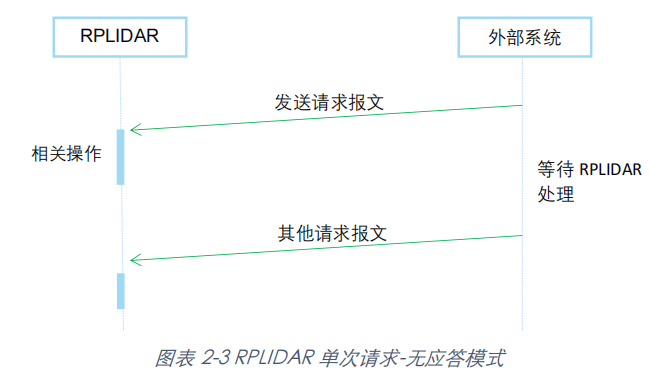

### 通讯数据格式
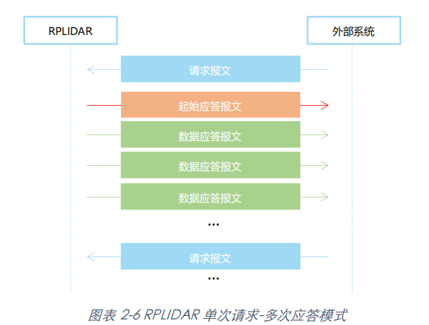

与激光雷达通讯的数据分为三种：
1. 请求报文
   
   起始标志(0xA5 长度1byte)+请求命令（+负载长度+负载数据+校验和）

   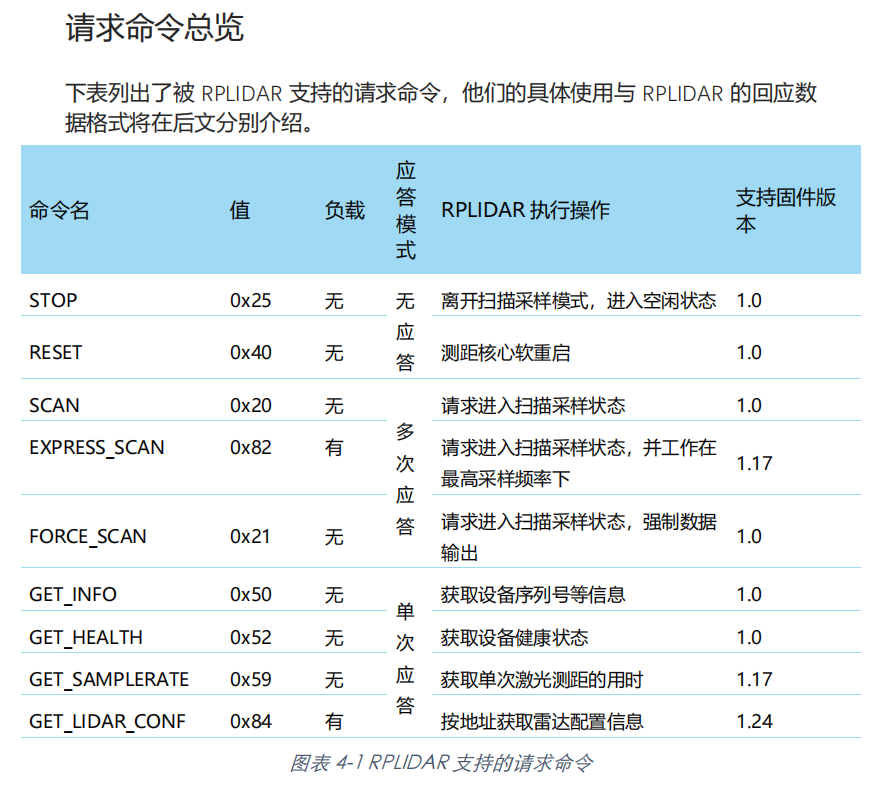
   
   参照上述报文格式，我们常用向雷达通过串口发送A5 20开启扫描(SCAN)模式，再发送A5 25停止扫描

   PS:一个完整的请求报文必须在5秒内完全发送至RPLIDAR。如果正在发送的请求报文花费超过5秒，RPLIDAR协议栈将认为通讯超时，该请求报文将被强制丢弃
2. 起始应答报文(长度7bytes)
   
   起始标志1(0xA5 长度1byte)+起始标志2(0x5A 长度1byte)+数据应答报文长度(长度30bits)+应答模式(长度2bits)+数据类型(长度1byte)
   
   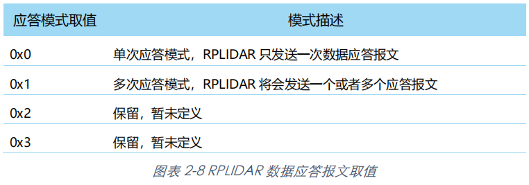

   参照上述报文格式，有SCAN初始应答报文：
   
   A5 5A 05 00 00 40 81

   0xA5,0xA5为起始标志1,2;

   0x05表示数据应答报文长度为5bytes;

   0x40(二进制1000000)表示应答模式为多次，单次应为0x00;

   PS:高速采样 (EXPRESS_SCAN)的起始应答报文

   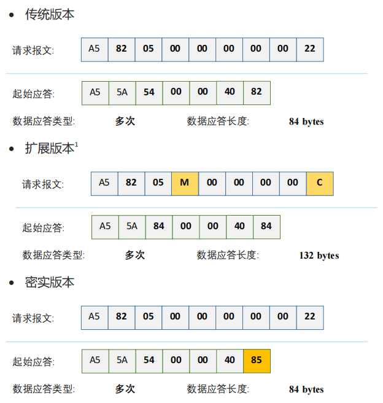

3. 数据应答报文
   1. SCAN模式的应答报文格式
    
    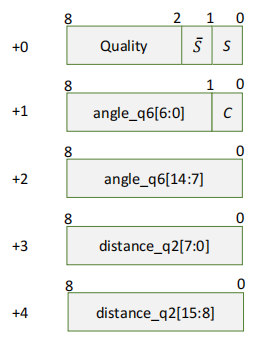 
    
    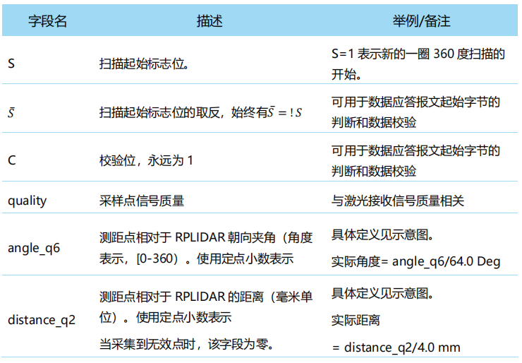

   2. EXPRESS_SCAN模式的应答报文格式
